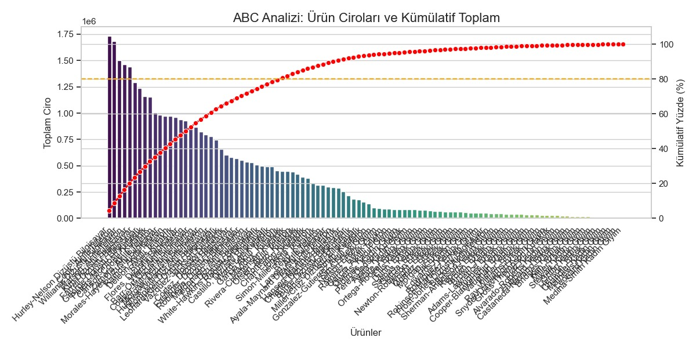
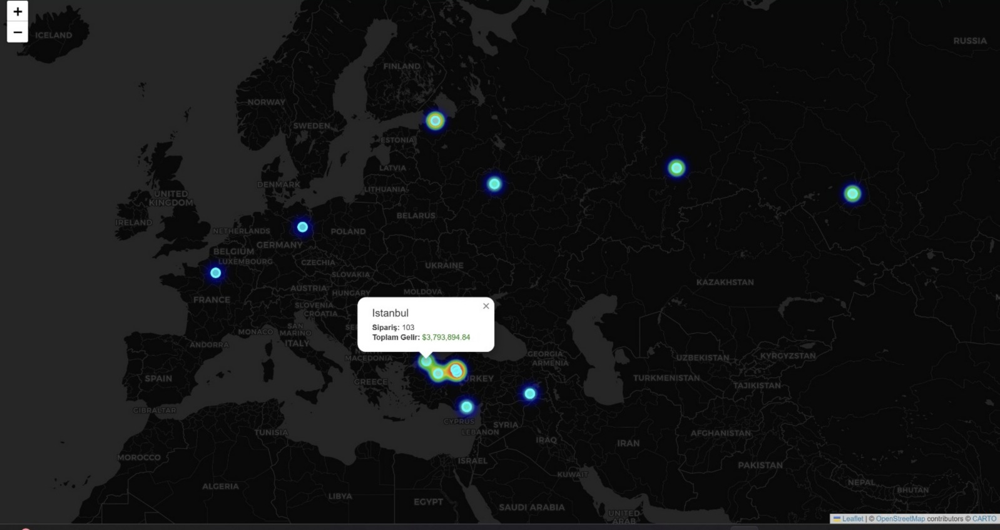

🚚 Multi-Language Supply Chain & Logistics Management System
Bu proje; global ölçekte operasyon yürüten bir lojistik ağının veritabanı mimarisini, veri üretim süreçlerini ve analiz aşamalarını kapsamaktadır. Sistem, Türkçe, İngilizce ve Rusça dillerini yerel düzeyde destekleyecek şekilde tasarlanmıştır.

🛠️ Teknolojiler
Database: PostgreSQL (İlişkisel Veritabanı Yönetimi)

Scripting: Python (Veri Üretimi ve Otomasyon)

Libraries: psycopg2 (DB Connection), faker (Synthetic Data)

Modeling: DrawSQL

Analytics: Power BI 

🏗️ Veritabanı Mimarisi (ER Diagram)
Proje, karmaşık ilişkileri yönetmek için Polimorfik (Polymorphic) bir yapı kullanmaktadır:

Addresses & Contacts: Tek bir tablo üzerinden hem Müşterilere (customers) hem de Depolara (warehouses) hizmet verir.

Product Management: Kategoriler, alt kategoriler ve 3 dilde (TR/EN/RU) ürün açıklamaları.

Transaction Flow: Stok yönetimi (inventory) ve sipariş detayları (order_items) ile tam izlenebilirlik.

🚀 Öne Çıkan Özellikler
Global Uyumluluk: Her ürünün ve kategorinin 3 dilde ismi, açıklaması ve slug yapısı mevcuttur.

Dinamik Stok Takibi: Depo bazlı envanter yönetimi ve minimum stok seviyesi uyarı sistemi.

Esnek Adres Yapısı: Müşterilerin ve depoların koordinat (latitude/longitude) bazlı konum takibi.

📁 Dosya Yapısı
/sql: Veritabanı şemasını oluşturan DDL kodları.
/scripts: Veritabanını Faker kütüphanesi ile dolduran Python kodları.
/powerbi: Veri görselleştirme ve KPI dashboardları.

## 📊 Proje Analiz Çıktıları

